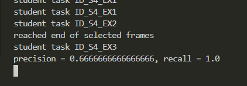

# Self Driving Car Beta Testing Nanodegree
# Midterm - 3D Object Detection


In this project, we used real-world data from the Waymo Open Dataset, detected objects in 3D point-clouds and evaluted the detections results. The major tasks accomplished to complete the project:

1. Compute Lidar Point-Cloud from Range Image
2. Create Birds-Eye View from Lidar PCL
3. Model-based Object Detection in BEV Image
4. Performance Evaluation for Object Detection


## Compute Lidar Point-Cloud from Range Image

### TASK: Visualize range image channels (ID_S1_EX1)

In the Waymo Open dataset, lidar data is stored as a range image. The range image is a two dimensional array. Its row is pitch, and its column is yaw, and it has two channels, range and intensity. This task is about extracting the "range" and "intensity" from the range image and converting the floating-point data to an 8-bit integer value range. 

<p>
    
    <br>
    <em>Fig. 1: Range Image</em>
</p>

### TASK: Visualize lidar point-cloud (ID_S1_EX2)

With simple coordinate frame transformation, we can obtain lidar point cloud from range image. The visibitliy of vehicles in point clund are varying, and the consistent features are rear bumper, wheels, side mirrors and rough vehicle frame. 
This task used the Open3D library to display the lidar point-cloud in a 3d viewer in order to develop a feel for the nature of lidar point-clouds. Below are a few examples.

<p>
    
    <br>
    
    <br>
    
    <br>
    
    <br>
    
    <br>
    
    <br>
    <em>Fig. 2: Lidar point-cloud in a 3d viewer</em>
</p>


## Create Birds-Eye View from Lidar PCL

### TASK: Convert sensor coordinates to BEV-map coordinates (ID_S2_EX1)

In this task, we created a birds-eye view perspective of the lidar point-cloud. Based on the (x,y)-coordinates in sensor space, we computed the respective coordinates within the BEV coordinate.

* vehicle frame is forward(x), left(y), and up(z), while BEV map frame is left(x), forward(y), and up(z)
* the two frame's scale is different too. vehicle frame's bourndary is the bounding box detection range limit, and BEV map's boundary is the image size, both are set in configurations
* for the origin of the frames, BEV's origin is at the bottom right of vehicle frame boundary

Vehicle frame point cloud are discretized into BEV space, and then the topmost z coordinate point will extracted out of identical x,y points in BEV space.

<p>
    
    <br>
    <em>Fig. 3: An example visualization into BEV map coordinates</em>
</p>

### TASK: Compute intensity layer of the BEV map (ID_S2_EX2)

We filled the "intensity" channel of the BEV map with data from the point-cloud. Intensity layer is normalized by the difference between max and min values before being stacked into BEV image.

<p>
    
    <br>
    <em>Fig. 3: Intensity Layer</em>
</p>

### TASK: Compute height layer of the BEV map (ID_S2_EX3)

We filled the "height" channel of the BEV map with data from the point-cloud. Height layer is normalized by detection bounding box range limit in z direction.

<p>
    
    <br>
    <em>Fig. 4: Height Layer</em>
</p>


## Model-based Object Detection in BEV Image

### TASK: Adding SFA3D model detection (ID_S2_EX1)

A pretrained model "Super Fast and Accurate 3D Object Detection based on 3D LiDAR Point Clouds" is used to perform inference on the BEV image generated above.

### TASK: Adding SFA3D model detection (ID_S2_EX1)

This task is about converting x, y, w, l from the BEV space into vehicle space, such that all detections have the format [1, x, y, z, h, w, l, yaw], where 1 denotes the class id for the object type vehicle.

<p>
    
    <br>
    <em>Fig. 5: Object Detection visualization</em>
</p>


## Performance Evaluation for Object Detection

In this step, the detection model is evaluated.

### IOU

For each correctly detected label, we computes the IOU score between label and detections. The main steps are

* For all pairs of lable and detection, calcuate IOU
* Assign detection to a label only its IOU is above certain threshold
* If a label has multiple eligible detections, pick the one with highest IOU score
* If a label has an eligible detection, increase the true positive by one

### Fasle positive, false negatives, true positives

For one single frame detections, the calcuation for above metrics are as below,  

```
## step 1 : compute the total number of positives present in the scene
all_positives = labels_valid.sum()

## step 2 : compute the number of false negatives
false_negatives = all_positives - true_positives

## step 3 : compute the number of false positives
false_positives = len(detections) - true_positives
```

### Precision and recall

For mulitple frame detection, the precision and recall metric calcuation is as below,

```
## step 1 : extract the total number of positives, true positives, false negatives and false positives
all_positives, true_positives, false_negatives, false_positives = np.array(pos_negs).sum(axis = 0)

## step 2 : compute precision
precision =  true_positives / float(true_positives + false_positives)

## step 3 : compute recall 
recall = true_positives / float(true_positives + false_negatives)
```

<p>
    
    <br>
    
    <br>
    <em>Fig. 6: Detection Performance Evaluation</em>
</p>

To make sure that the code produces plausible results, the flag configs_det.use_labels_as_objects should be set to True in a second run. The resulting performance measures for this setting should be the following:

<p>
    
</p>

